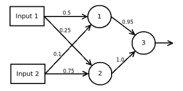

# Forward Propagation
Jeffrey Norton  
January 2017  


# Forward Propagation

Forward propagation is the process propogating the signal from the
input layer to the output or visual layer.  Here is a three-layer network
which I found on
[Stack Exchange](http://stats.stackexchange.com/questions/147954/neural-network-forward-propagation) along with how to do the forward propogation.



In neural network "speak", there is an input layer consisting of Inputs 1 and 2, a hidden layer consisting of nodes (neurons) 1 and 2, and an output node 3.  It is convenient to refer to each of these layers numerically:  
1. Inputs 1 and 2  
2. Neurons 1 and 2  
3. Neuron 3  

Each of the hidden and output neurons are logistic neurons meeting that they apply the logistic function

$\sigma(t) = \frac{1}{1 + e^{-t}}$


```r
sigma <- function(t) 1/(1+exp(-t))
sum.inputs <- function(bias, x, weights) bias + sum(x*weights)
```

to the input before returning the response.

Let Input 1 have value 1 and Input 2 have value 0.  Calculate
the output on hidden Neuron 1.

```r
input.1 <- 1
input.2 <- 0
weight.input1.to.1 <- 0.5
weight.input2.to.1 <- 0.1
a.1 <- sigma(
  sum.inputs(0.0,
    c(input.1,input.2),c(weight.input1.to.1,weight.input2.to.1)   )
)
print(a.1)
```

```
## [1] 0.6224593
```

Calculate the output on hidden Neuron 2.

```r
weight.input1.to.2 <- 0.25
weight.input2.to.2 <- 0.75
a.2 <- sigma(
  sum.inputs(0.0,
    c(input.1,input.2),c(weight.input1.to.2,weight.input2.to.2)   )
)
print(a.2)
```

```
## [1] 0.5621765
```
Now, calculate the output on the visible Neuron 3.

```r
weight.a1.to.3 <- 0.95
weight.a2.to.3 <- 1.0
a.3 <- sigma(
  sum.inputs(0.0,
    c(a.1,a.2),c(weight.a1.to.3,weight.a2.to.3)   )
)
print(a.3)
```

```
## [1] 0.760152
```

The problem can be formulated as a series of matrix operations:

```r
W.1 <- matrix(c(weight.input1.to.1, weight.input1.to.2, weight.input2.to.1, weight.input2.to.2),
              nrow=2, ncol=2)
x.1 <- matrix(c(input.1,input.2),nrow=2,ncol=1)
A.2 <- sigma(W.1 %*% x.1)
print(A.2)
```

```
##           [,1]
## [1,] 0.6224593
## [2,] 0.5621765
```

```r
W.2 <- matrix(c(weight.a1.to.3,weight.a2.to.3), nrow=1, ncol=2)
A.3 <- sigma(W.2 %*% A.2)
print(A.3)
```

```
##          [,1]
## [1,] 0.760152
```

The matrix formulation is very useful when modeling much larger neural networks and also makes programming the networks in languages such as R and Octave much simpler.


