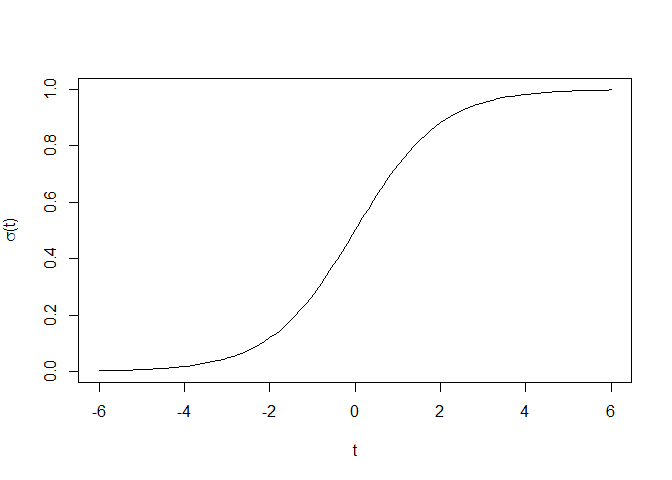

# Neurons
Jeffrey Norton  
January 2017  


# McCullogh-Pitts Neurons

There are several references which are helpful in understanding McCullogh-Pitts neurons,
but [this one](https://www.lri.fr/~marc/EEAAX/Neurones/tutorial/mcpits/html/index.html)
was helpful.  The key formula is given by Hinton in his PDF notes.

1) Compute a weighted sum plus a bias.
$z = b + \sum_i x_i w_i$.
2) Output 1 if $z > 0$.  $y = 1 $ if $y \gt 0$, $0$ otherwise

## Example
The inputs $x$ consist of excitatory inputs with values ${0, 1}$,

```r
n=10
(x_excite=sample(c(0,1), n, replace=TRUE))
```

```
##  [1] 1 1 0 1 1 0 0 1 0 1
```

```r
(w_excite=runif(n, min=0, max=1))
```

```
##  [1] 0.7325297 0.3701602 0.4372588 0.4223040 0.5848643 0.4386610 0.9518534
##  [8] 0.8742495 0.9614086 0.3534819
```
inhibitory inputs with values ${0, 1}$,

```r
m=8
(x_inhibit=sample(c(-1,0), m, replace=TRUE))
```

```
## [1] -1  0  0 -1  0 -1  0 -1
```

```r
(w_inhibit=runif(m, min=0, max=1))
```

```
## [1] 0.99537695 0.05115953 0.16525083 0.48302983 0.17960986 0.87659003
## [7] 0.99520737 0.15669747
```
and the threshold of $0$ as described above

```r
(u = 0)
```

```
## [1] 0
```
Calculate the weighted sum as shown above with bias of $0.5$.

```r
b = 0.5
(z = b + sum(x_excite, w_excite) + sum(x_inhibit, w_inhibit))
```

```
## [1] 12.52969
```
Calculate the neuron output of $y$ using the
[Heaviside function](https://en.wikipedia.org/wiki/Heaviside_step_function)

```r
(y = ifelse(z > u, 1.0, 0.0))
```

```
## [1] 1
```

# Perceptrons
The [Wikipedia](https://en.wikipedia.org/wiki/Perceptron) entry is a good place to start.
It turns out that the definition given in the previous section matches Wikipedia's
definition of a Perceptron.

We can rewrite our equation above as $y = \sigma(b + \sum_i x_i w_i)$ where $\sigma$
is called the transfer function.  In the case above, the transfer function is the
Heaviside function.

According to Wikipedia, "modern" perceptrons use functions like the
[sigmoid function](https://en.wikipedia.org/wiki/Sigmoid_function) as the transfer 
function $\sigma$.  Examples of sigmoids include the logisitic function $\sigma(t) = \frac{1}{1+e^{-t}}$

```r
sigma <- function(t) 1/(1+exp(-t))

plot(x=seq(from=-6,to=6,length.out=100), y=sigma(seq(from=-6,to=6,length.out=100)), type="l", xlab="t", ylab=expression(paste(sigma,"(t)")) )
```

<!-- -->
  
which has y-asymptotes at 0 and 1 and 
has the property that its derivative can be expressed as a function of itself,
$\sigma'(t) = \sigma(t) (1 - \sigma(t))$.

Another sigmoid functions used in as the activation function is the hyperbolic tangent
$\tanh(t) = \frac{1-e^{-2t}}{1+e^{-2t}} = 2 \sigma(2t)-1$ which has y-asymptotes -1 and 1.

See LeCun's paper [Efficient Backprop](http://yann.lecun.com/exdb/publis/pdf/lecun-98b.pdf) for reasons for
choosing one or the other.
