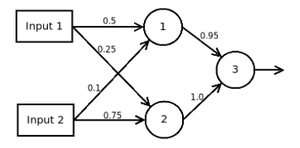

# Forward Propagation
Jeffrey Norton  
January 2017  


# Forward Propagation

Forward propagation is the process propogating the signal from the
input layer to the output or visual layer.  Here is a three-layer network
which I found on
[Stack Exchange](http://stats.stackexchange.com/questions/147954/neural-network-forward-propagation) along with how to do the forward propogation.



In neural network "speak", there is an input layer consisting of Inputs 1 and 2, a hidden layer consisting of nodes (neurons) 1 and 2, and an output node 3.  It is convenient to refer to each of these layers numerically:  
1. Inputs 1 and 2  
2. Neurons 1 and 2  
3. Neuron 3  

Each of the hidden and output neurons are logistic neurons meeting that they apply the logistic function

$\sigma(t) = \frac{1}{1 + e^{-t}}$


```r
sigma <- function(t) 1/(1+exp(-t))
sum.inputs <- function(bias, x, weights) bias + sum(x*weights)
```

to the input before returning the response.

Let Input 1 have value 1 and Input 2 have value 0.  Calculate
the output on hidden Neuron 1.

```r
input.1 <- 1
input.2 <- 0
weight.input1.to.1 <- 0.5
weight.input2.to.1 <- 0.1
a.1 <- sigma(
  sum.inputs(0.0,
    c(input.1,input.2),c(weight.input1.to.1,weight.input2.to.1)   )
)
print(a.1)
```

```
## [1] 0.6224593
```

Calculate the output on hidden Neuron 2.

```r
weight.input1.to.2 <- 0.25
weight.input2.to.2 <- 0.75
a.2 <- sigma(
  sum.inputs(0.0,
    c(input.1,input.2),c(weight.input1.to.2,weight.input2.to.2)   )
)
print(a.2)
```

```
## [1] 0.5621765
```
Now, calculate the output on the visible Neuron 3.

```r
weight.a1.to.3 <- 0.95
weight.a2.to.3 <- 1.0
a.3 <- sigma(
  sum.inputs(0.0,
    c(a.1,a.2),c(weight.a1.to.3,weight.a2.to.3)   )
)
print(a.3)
```

```
## [1] 0.760152
```

The problem can be formulated as a series of matrix operations:

```r
W.1 <- matrix(c(weight.input1.to.1, weight.input1.to.2, weight.input2.to.1, weight.input2.to.2),
              nrow=2, ncol=2)
print(W.1)
```

```
##      [,1] [,2]
## [1,] 0.50 0.10
## [2,] 0.25 0.75
```

```r
x.1 <- matrix(c(input.1,input.2),nrow=2,ncol=1)
print(x.1)
```

```
##      [,1]
## [1,]    1
## [2,]    0
```

```r
A.2 <- sigma(W.1 %*% x.1)
print(A.2)
```

```
##           [,1]
## [1,] 0.6224593
## [2,] 0.5621765
```

```r
W.2 <- matrix(c(weight.a1.to.3,weight.a2.to.3), nrow=1, ncol=2)
print(W.2)
```

```
##      [,1] [,2]
## [1,] 0.95    1
```

```r
A.3 <- sigma(W.2 %*% A.2)
print(A.3)
```

```
##          [,1]
## [1,] 0.760152
```

The matrix formulation is very useful when modeling much larger neural networks and also makes programming the networks in languages such as R and Octave much simpler.

# Calculating Error Terms

Since neural and deep networks are typically used for prediction, the training process often has a target value which is the value from the training set.
Minimization of the error is typically how the set is trained.
Optimization algorithms such as stochastic gradient descent ([start here](https://en.wikipedia.org/wiki/Stochastic_gradient_descent)) are really at the heart of machine learning.
Back propagation is the way that values of the network are updated so as to minimize the error between the output from forward propagation and the target value.

The cost function is defined as  
$C = \frac{1}{2} (y - t)^2$  
where $y$ is the output from the network and $t$ is the target value which for this case we will set to $0.5$.


```r
target <- 0.5
y.out <- A.3[1,1]
predict.cost <- function(y,t) 1/2 * (y-t)^2
cost <- predict.cost(y.out,target)
print(cost)
```

```
## [1] 0.03383952
```

Back propagation, as mentioned above, tries to drive the cost
derived above to zero.  To do so, consider the error at each
layer of the net.  At layer 3 (the visible layer), the error
term $\delta^{(3)}$ is given as the derivative of cost against
the output of the second layer, that is  
$\delta^{(3)} = \frac{dC}{dz^{(2)}}$.
Each $z^{(i)}$ is defined as $z^{(i)} = W^{(i)} * X^{(i)}$ where $W^{(i)}$ are the weights (matrix) at layer $i$ and $X^{(i)}$ are the values at the neurons at layer $i$.

Carefully calculate the error term.  Starting with the cost
function above, $C = \frac{1}{2} (y-t)^2$ we observe that
$y = A.3$ in our R code and we write  
$C = \frac{1}{2} (A.3 - 0.5)^2$  
$C = \frac{1}{2} (\sigma(z^{(2)} - 0.5))$   
and
$\frac{dC}{dz^{(2)}} = (\sigma(z^{(2)} - 0.5)) .* \sigma(z^{(2)}) .* (1 - \sigma(z^{(2)})$  
given the derivative of the logistic function and where $.*$ represents element-wise multiplication.  Now   
$\delta^{(3)} = \frac{dC}{dz^{(2)}} = (a^{(3)} - .5) .* a^{(3)} .* (1 - a^{(3)})$  

```r
delta.3 <- (A.3 - 0.5) * A.3 * (1-A.3)
print(delta.3)
```

```
##            [,1]
## [1,] 0.04743116
```
Now we can back propagate the error term $\delta^{(3)}$ to find the error term at layer 2, $\delta^{(2)}$:  
$\delta^{(2)} = \frac{dC}{dz^{(2)}} \frac{dz^{(2)}}{dz^{(1)}} = \delta^{(3)} \frac{dz^{(2)}}{dz^{(1)}}$  
where we calculate $\frac{dz^{(2)}}{dz^{(1)}}$ using the
definition of $z^{(2)} = W^{(2)} * \sigma(z^{(1)})$.

$\frac{dz^{(2)}}{dz^{(1)}} =
\frac{d(W^{(2)} \sigma(z^{(1)}))}{dz^{(1)}} =
W^{(2)} \frac{d(\sigma(z^{(1)}))}{dz^{(1)}} =
W^{(2)} .* \sigma(z^{(1)}) .* (1 - \sigma(z^{(1)})) =
W^{(2)} .* a^{(2)} .* (1 - a^{(2)})$

and

$\delta^{(2)} = \delta^{(3)} * W^{(2)} .* a^{(2)} .* (1 - a^{(2)})$


```r
delta.2 <- t(delta.3 %*% W.2) * A.2 * (1 - A.2)
print(delta.2)
```

```
##            [,1]
## [1,] 0.01058917
## [2,] 0.01167442
```
for both of the neurons on layer 2.  With these error terms, we can modify the weights on the layers.
